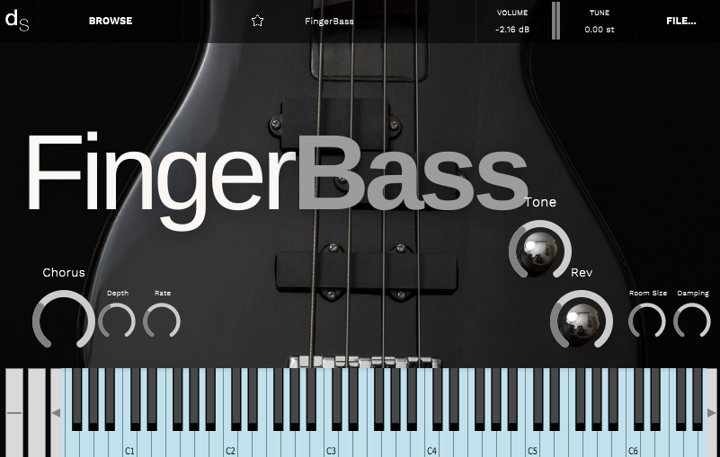

# Bass Lite Version: 0.0.1

Date: 18 April 2024
By: Moodgiver - Antonio Nardone

## The Story
Bank was created from my free samples library, looped and mapped with accuracy in order to get the best sound.

Samples are available for each of bass type (Acoustic, Fingered and Picked), with an extra harm sample in order to simulate the harmonic (electric bass) that is triggered only with velocities less then 50.

The quality of samples makes the job easier and faster and the most important job was to select and manipulate the right sample.

## Using the instrument

3 models

- AcoBass: Tipical acoustic bass with Tone, Rev and Chorus controls
- FingerBass: Electric finger bass samples with Tone, Rev and Chorus controls
- PickedBass: Electric picked bass samples with Tone, Rev and Chorus controls

## Included formats

- Decent Sampler

## Release notes
First release. For any problem or advice please contact me.

